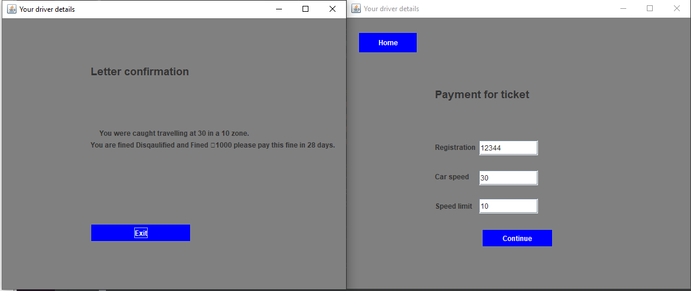

# Speed Ticket Program
This program was made during my first year of university for my programming unit.

This was a simple and basic program which was made in Java for users to input a drivers speed to which it will issue the user a fine depending on the speed of the vehicle. 

The fine will then be saved in a txt file for the user to examine.

This assignment was developed to purposely help me understand the use of OOP and GUI to which the design was very simple and basic.

## Speed Ticket Example

## View project
[See the SpeedTickProgram project on github!](https://github.com/Ayrtonv97/SpeedingTicket)